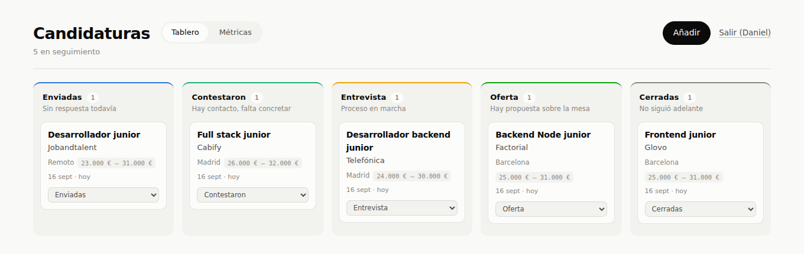

<div align="center">

# Gestor de candidaturas

**Un tablero Kanban para la búsqueda de empleo, con arrastre accesible, actualización optimista reversible y métricas que no mienten cuando no hay datos.**

[](https://github.com/danielbuitragoh/gestor-postulaciones/actions/workflows/ci.yml)



[La API que consume](https://github.com/danielbuitragoh/api-postulaciones) · [Daniel Buitrago](https://github.com/danielbuitragoh)

</div>

---

## Qué es

El cliente web del tablero de candidaturas. Te registras, das de alta cada candidatura y la mueves de columna según avanza el proceso: enviada, contestaron, entrevista, oferta, cerrada. Cada movimiento queda registrado como un evento en la API, y con ese historial la pantalla de métricas te dice cuánto tardan de media en contestarte y por dónde se te caen los procesos.

Es un front hecho a mano contra una API propia: React 19 con TypeScript, sin librería de estado, sin librería de gráficos y sin plantilla de componentes. Todo lo que hay está porque resuelve un problema concreto de esta pantalla.

## Lo que más me interesa que se mire

**El arrastre usa @dnd-kit y no el arrastrar y soltar nativo de HTML.** El nativo no funciona con teclado, y mover una tarjeta es *la* acción de esta pantalla: dejarla fuera del alcance de quien no usa ratón no es un detalle de accesibilidad, es quitar la mitad del producto. @dnd-kit trae sensor de teclado y anuncios para lector de pantalla, y aquí están escritos uno a uno ("Has cogido la candidatura…", "Soltada en Entrevista"). Además, cada tarjeta lleva un selector de estado: arrastrar es la vía rápida, no la única. Eso es también lo que hace usable el tablero en móvil, donde las cinco columnas no caben a la vez y arrastrar entre ellas es incómodo hasta para quien puede hacerlo.

**El refresco del token de acceso es una sola promesa compartida.** Es el fallo que no aparece en desarrollo y sí en producción: si la pantalla lanza tres peticiones a la vez y el token ha caducado, las tres reciben 401 y las tres piden refresco. Como la API rota el token, la primera lo consume y las otras dos llegan con uno ya revocado, así que el usuario se ve expulsado sin motivo y de forma intermitente. La solución es un candado: la segunda llamada espera la misma promesa que la primera en lugar de abrir otra petición, y el candado se suelta pase lo que pase, porque soltarlo solo al ir bien deja la aplicación colgada esperando una promesa rechazada que nadie va a reintentar.

**La actualización optimista lleva reversión y aviso.** Mover una tarjeta escribe primero en la pantalla y después en el servidor, porque esperar la respuesta deja la tarjeta pegada al dedo medio segundo. Lo que casi nunca se implementa es la otra mitad: si el servidor rechaza el cambio, la tarjeta vuelve a su columna y se avisa de por qué. Una actualización optimista sin vuelta atrás es peor que no tenerla, porque la pantalla afirma un estado que el servidor no conoce y el usuario solo se entera al recargar.

**El token de acceso vive solo en memoria y nunca en localStorage.** Cualquier script que se cuele en la página —una dependencia comprometida, una extensión— puede leer localStorage entero. El de refresco sí va a localStorage, y está documentado en el código como el compromiso que es: lo correcto sería una cookie `httpOnly`, que exige que el front y la API compartan dominio, y este front está pensado para desplegarse aparte. La mitigación es real, no retórica: la API rota el token en cada uso, así que uno robado deja de servir en cuanto el usuario legítimo refresca.

**Las cinco columnas del tablero no son los ocho estados de la API.** Se agrupan a propósito: `guardada` es un borrador y `retirada` una salida, no fases del proceso, y ocho columnas obligan a desplazarse en horizontal para ver si hay una oferta, que es justo lo único que quieres ver de un vistazo. Lo importante es que los estados sin columna propia se recogen en la más cercana en lugar de desaparecer: un dato que existe y no se ve en ninguna parte es peor que uno colocado en la columna de al lado, porque el usuario lo da por perdido.

**Los mensajes de validación se pintan junto a su campo, enlazados con `aria-describedby`.** La API devuelve los errores campo a campo y el formulario los coloca donde toca, con `aria-invalid` en el input. Un aviso genérico arriba del formulario obliga a adivinar cuál de los ocho campos está mal, y sin el enlace un lector de pantalla lee el campo sin decir nunca qué le pasa.

**El diálogo es el elemento `<dialog>` nativo.** Trae el foco atrapado dentro, la tecla Escape, el fondo inerte y la capa superior sin pelear con z-index. Reimplementar eso con un `<div>` es exactamente cómo se producen los modales que dejan tabular a los enlaces de detrás.

**Las métricas se dibujan con HTML y CSS, sin librería de gráficos.** Son tres barras y un embudo: meter cien kilobytes de librería en el paquete para eso es peso que paga el usuario en cada carga a cambio de nada. Las barras llevan la cifra escrita además de dibujada, porque una barra sin número obliga a estimar contra un eje que aquí no existe.

**Con cero candidaturas se muestra un estado vacío con una instrucción, no un panel de ceros.** Un embudo a cero no está midiendo nada, y decirlo con números sugiere un resultado que no existe. Por la misma razón las tasas se devuelven como `null` y no como `0` cuando no hay denominador, y se pintan como un guion: un 0 % de entrevistas sobre cero candidaturas es una afirmación falsa sobre tu búsqueda de empleo.

## Stack

- **React 19** y **TypeScript**, en modo estricto.
- **Vite** para desarrollo y empaquetado.
- **@dnd-kit** (`core`, `sortable`, `utilities`) para el arrastre accesible.
- **Oxlint** como linter.
- Sin librería de estado, sin librería de gráficos y sin framework de CSS: el estado del tablero cabe en un hook propio (`src/estado/usarPostulaciones.ts`) y la sesión en un contexto.

Se probó de punta a punta contra la API y PostgreSQL reales: registro, ocho candidaturas, movimientos entre columnas, métricas correctas y la sesión sobreviviendo a recargar la página, con cero errores en consola.

## Cómo correrlo

Necesitas la [API](https://github.com/danielbuitragoh/api-postulaciones) levantada.

```bash
npm install
```

Apunta el cliente a tu API con la variable `VITE_API` (si no la defines, usa `http://localhost:3000`):

```bash
echo 'VITE_API=http://localhost:3000' > .env.local
npm run dev
```

Los demás comandos:

```bash
npm run build     # comprueba tipos y empaqueta
npm run lint      # oxlint
npm run preview   # sirve lo empaquetado
```

## Licencia

MIT · [Daniel Buitrago](https://github.com/danielbuitragoh)
